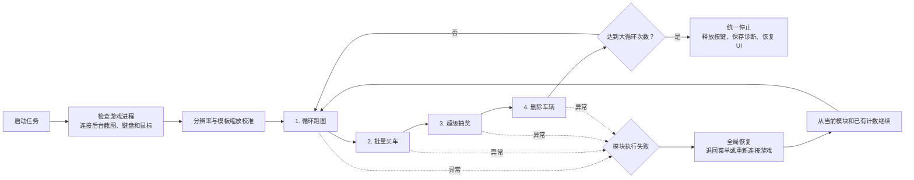

# 整体架构与大循环

## 统一调度流程

## 路线控制

UI 当前提供以下流程连接开关：

- 跑图 → 买车
- 买车 → 抽奖
- 抽奖 → 跑图
- 跑图 → 删车
- 删车 → 跑图

完整路线开启时，调度优先级确保实际执行顺序为：

`跑图 → 买车 → 抽奖 → 删车 → 跑图`

如果关闭“跑图 → 买车”，也可以使用较短的“跑图 → 删车 → 跑图”路线。

## 统一失败恢复

每个模块向调度器返回成功或失败状态：

- 成功：记录模块完成次数，进入配置的下一模块。
- 失败：执行全局恢复，然后从当前模块与已有计数继续。
- 连续恢复超过上限：统一停止任务，释放所有按键。
- 达到大循环次数：统一调用停止逻辑，不由模块自行无限轮询。
