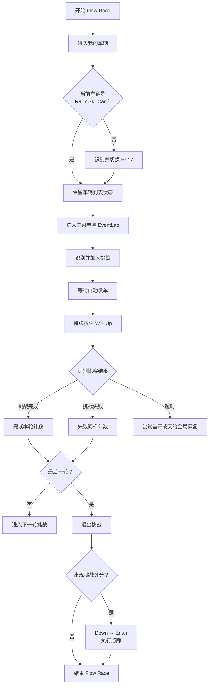

# Flow Race：循环跑图

## 流程图

## 关键实现

- 使用 `skillcar_r917.png` 确认或切换刷图车辆。
- 通过模板匹配定位 EventLab、加入挑战和比赛结果。
- 比赛期间持续保持 `W + Up`。
- 挑战完成和挑战失败都会计入本轮次数。
- 末轮失败时按 Esc 退出，不再重试。
- 挑战评分弹窗为可选页面，出现时执行点踩。
- 超时或页面状态异常时交给统一恢复逻辑。
