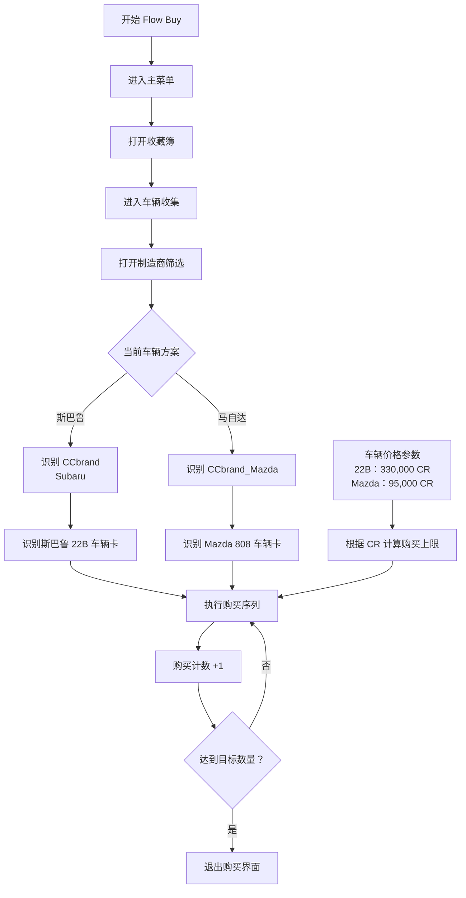

# Flow Buy：批量买车

## 流程图

## 车辆方案

| 方案 | 品牌模板 | 车辆模板 | 单价 |
|---|---|---|---:|
| 斯巴鲁 22B | `CCbrand.png` | `consumablecar.png` | 330,000 CR |
| Mazda 808 | `CCbrand_Mazda.png` | `consumablecar_Mazda.png` | 95,000 CR |

## 关键实现

- 斯巴鲁与马自达共用已经稳定的购买主流程。
- 车辆切换只改变品牌模板、车辆模板和价格参数。
- CR 限制根据车辆单价计算最多可购买数量。
- 达到购买数量或 CR 上限后，返回统一调度器。
