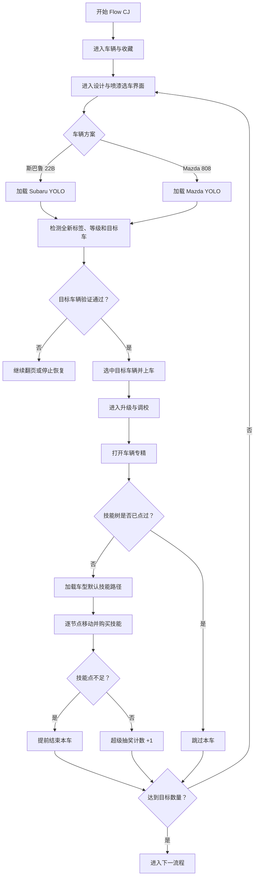

# Flow CJ：车辆专精与超级抽奖

## 流程图

## 关键实现

- 选车阶段已经由模板匹配切换为车型专用 YOLO 模型。
- YOLO 同时关联全新标签、车辆等级和目标车辆，降低误选风险。
- Subaru 与 Mazda 分别加载对应模型和默认技能树路径。
- UI 中手动编辑的技能树路径仍然可用。
- 检测到技能已经购买时跳过该车。
- 技能点不足时提前结束专精环节并返回调度器。
