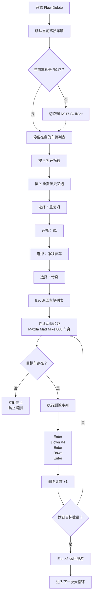

# Flow Delete：删除车辆

## 流程图

## 筛选条件

1. 重复项
2. S1
3. 漂移赛车
4. 传奇

第 13～30 次 Down 位于固定列表的无目标区间，因此使用快速导航；第 31 次开始恢复模板识别。

## 安全机制

- 删除流程只适配 Mazda 808。
- 正式删除前必须连续两帧确认 Mad Mike 808 车身。
- 每删除一辆后都会重新验证剩余车辆列表。
- 无法确认目标车时立即停止，不发送删除按键。
- 全局恢复后从已有删除计数继续，避免超过设定数量。
