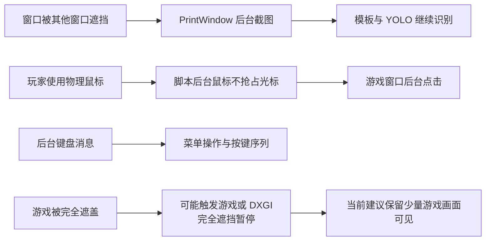

# 后台运行能力与技术对比

## 后台运行能力

## 能力边界

- `PrintWindow` 允许游戏窗口被其他窗口遮挡时继续识图。
- 后台鼠标通过游戏客户区坐标点击，不移动玩家的物理鼠标。
- 后台键盘通过窗口消息发送菜单与流程按键。
- 游戏窗口完全被遮挡时，可能触发游戏或 DXGI 的遮挡暂停。
- 完全遮挡暂停与普通模板匹配无关，当前建议保留少量游戏画面可见。

## 四个模块技术对比

| 模块 | 主要识别方式 | 核心目标 | 关键安全机制 |
|---|---|---|---|
| Flow Race | 模板匹配、比赛结果判定 | 自动循环挑战并获得技能点 | 成功/失败互斥判断、末轮退出、评分弹窗兼容 |
| Flow Buy | 品牌与车辆卡模板匹配 | 按车辆方案批量购买 | 车辆价格参数、CR 购买上限 |
| Flow CJ | 车型专用 YOLO + 模板匹配 | 选择全新目标车并购买技能 | 多特征车辆验证、车型专用模型、技能点不足检测 |
| Flow Delete | 筛选模板 + 目标车身验证 | 删除已经消耗技能树的 Mazda | 四重筛选、连续两帧验证、逐辆确认、断点续删 |
