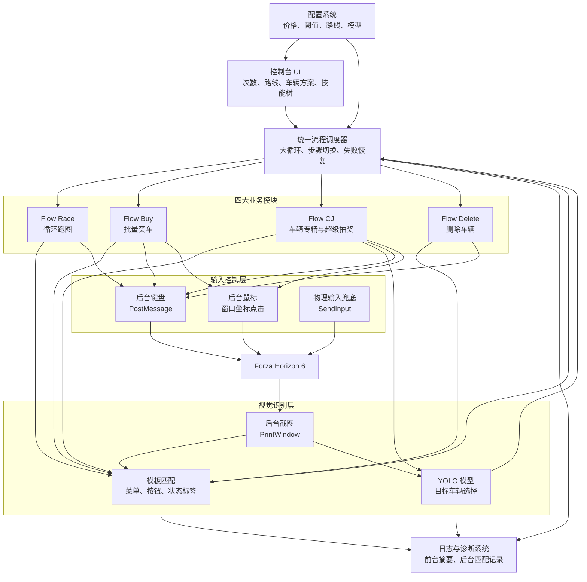
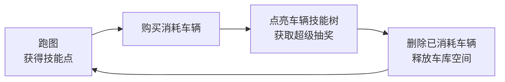

# FH6 Auto 项目逻辑说明

本目录用于说明项目的整体架构、大循环调度方式，以及四个主要业务模块的实现逻辑。

## 文档索引

- [整体架构与大循环](01-system-and-loop.md)
- [Flow Race：循环跑图](02-flow-race.md)
- [Flow Buy：批量买车](03-flow-buy.md)
- [Flow CJ：车辆专精与超级抽奖](04-flow-cj.md)
- [Flow Delete：删除车辆](05-flow-delete.md)
- [后台运行能力与技术对比](06-runtime-and-comparison.md)

## 项目整体架构

## 完整业务闭环

完整大循环为：

`循环跑图 → 批量买车 → 超级抽奖 → 删除车辆 → 循环跑图`
